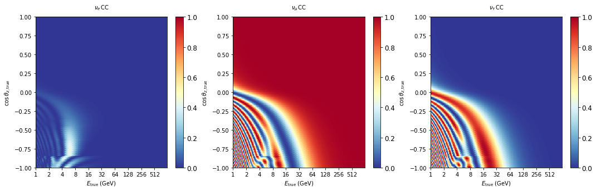

[Introduction](pisa/README.md) |
[Installation](INSTALL.md) |
[Documentation](http://icecube.wisc.edu/%7Epeller/pisa_docs/index.html) |
[Terminology](pisa/glossary.md) |
[License](LICENSE) |
[Contributors](CONTRIBUTORS.md) |
[Others' work](EXTERNAL_ATTRIBUTION.md)

PISA is a software written to analyze the results (or expected results) of an experiment based on Monte Carlo simulation.

In particular, PISA was written by and for the IceCube Collaboration for analyses employing the [IceCube Neutrino Observatory](https://icecube.wisc.edu/), including the [DeepCore](https://arxiv.org/abs/1109.6096) and the proposed [PINGU](https://arxiv.org/abs/1401.2046) low-energy in-fill arrays.
However, any such experiment—or any experiment at all—can make use of PISA for analyzing expected and actual results.

PISA was originally developed to cope with low-statistics Monte Carlo (MC) for PINGU when iterating on multiple proposed geometries by using parameterizations of the MC and operate on histograms of the data rather than directly reweighting the MC (as is traditionally done in high-energy Physics experiments).
However, PISA's methods apply equally well to high-MC situations, and PISA also performs traditional reweighted-MC analysis as well.

If you use PISA, please cite our publication (e-Print available here: https://arxiv.org/abs/1803.05390):
```
"Computational Techniques for the Analysis of Small Signals
in High-Statistics Neutrino Oscillation Experiments"
IceCube Collaboration - M.G. Aartsen et al. (Mar 14, 2018)
Published in: Nucl.Instrum.Meth.A 977 (2020) 164332
```


# Quick start

## Installation

```shell
git clone git@github.com:icecube/pisa.git
cd pisa
pip install -e .
```

For detailed installation instructions and common issues see [Installation](INSTALL.md)

## Minimal Example

Producing some oscillograms


```python
from pisa.core import Pipeline
import matplotlib.pyplot as plt
```

    << PISA is running in single precision (FP32) mode; numba is running on CPU (single core) >>


Instantiate a `Pipeline` or multiple pipelines in a `DistributionMaker` using PISA config files


```python
template_maker = Pipeline("settings/pipeline/osc_example.cfg")
```

Run the pipleine with nominal settings


```python
template_maker.run()
```

Get the oscillation probabilities 


```python
outputs = template_maker.data.get_mapset('prob_mu')
```

Plot some results


```python
fig, axes = plt.subplots(figsize=(18, 5), ncols=3)
outputs['nue_cc'].plot(ax=axes[0], cmap='RdYlBu_r', vmin=0, vmax=1);
outputs['numu_cc'].plot(ax=axes[1], cmap='RdYlBu_r', vmin=0, vmax=1);
outputs['nutau_cc'].plot(ax=axes[2], cmap='RdYlBu_r', vmin=0, vmax=1);
```




